# LinguaCoach AI

An AI-powered language coaching platform for structured daily practice: chat, speaking, translation, grammar correction, drills, roleplays, vocabulary SRS, homework, and progress analytics.

## Table of Contents
- [1. What This Project Is](#1-what-this-project-is)
- [2. Free App + Two Runtime Modes](#2-free-app--two-runtime-modes)
- [3. Core Product Features](#3-core-product-features)
- [4. Architecture](#4-architecture)
- [5. Tech Stack](#5-tech-stack)
- [6. Repository Structure](#6-repository-structure)
- [7. Quick Start](#7-quick-start)
- [8. Local Model Setup](#8-local-model-setup)
- [8.2 Quick Local Setup (Copy/Paste)](#82-quick-local-setup-copypaste)
- [8.3 Expected Disk Usage](#83-expected-disk-usage)
- [9. Environment Variables](#9-environment-variables)
- [10. API and Diagnostics](#10-api-and-diagnostics)
- [11. Testing](#11-testing)
- [12. CI](#12-ci)
- [13. UI Screenshots](#13-ui-screenshots)
- [14. Test and CI Screenshots](#14-test-and-ci-screenshots)
- [15. Troubleshooting](#15-troubleshooting)
- [16. Stop / Cleanup](#16-stop--cleanup)
- [17. Contributor Notes](#17-contributor-notes)

---

## 1. What This Project Is

**LinguaCoach AI** is a local-first language learning platform designed for short, repeatable daily practice cycles.

Functional scope:
- first-launch onboarding and placement test
- isolated language workspaces per language pair
- daily guided session flow
- coach chat with correction-driven feedback
- speaking studio (audio upload/recording, ASR, coaching rubric)
- translation lab (text + voice pipeline)
- grammar analyzer with answer memory
- drills, roleplay scenarios, and homework workflows
- vocabulary bank with SRS review
- progress center: streak, skill map, CEFR tree, timeline, weekly review

---

## 2. Free App + Two Runtime Modes

LinguaCoach AI is **free to use**. Runtime behavior is selected per provider mode:

### OpenAI mode (`openai`)
- Fastest setup and smallest local footprint
- Typically the best quality with minimal setup effort
- Important: costs are paid to OpenAI directly, not to this app
- In many personal usage patterns, monthly cost stays low (often a few USD, depending on request volume and token usage)

### Local mode (`local`)
- Fully local inference pipeline
- No OpenAI usage cost for model inference
- Can be deployed in your own infrastructure / containers
- Suitable for fully controlled/private/self-hosted operation
- Important: requires pre-downloaded local models and more machine resources
- Typical local model bundle size: about **14 GB**

---

## 3. Core Product Features

- Onboarding + placement + personalized starter plan
- Workspace-based progress isolation
- Dashboard with focus, rewards, growth, and milestones
- Daily Session with step-by-step guided progression
- Coach Chat Studio with actionable corrections
- Voice Studio with dynamic metrics and retry loop
- Grammar Analyzer with corrections, mistakes breakdown, and memory
- Drills: generated tasks + rubric grading
- Roleplays: scenario cards by level and focus
- Word Bank + SRS review cycle
- Homework cards with submission flow
- Profile runtime controls (LLM/ASR/TTS provider matrix)
- Backup, restore, and reset tools

---

## 4. Architecture

Services:
- `services/api` - FastAPI orchestrator, business logic, DB models, API routes
- `services/asr` - speech-to-text service (`openai` / `local`)
- `services/tts` - text-to-speech service (`openai` / `local`)
- `postgres` - main database (Docker mode)
- `web` - React SPA frontend
- `desktop` - Electron shell over the web UI

Flow:
1. UI calls API (`:8000`)
2. API calls ASR (`:8001`) and TTS (`:8002`) when needed
3. Runtime providers can be switched between `openai` and `local`

---

## 5. Tech Stack

Backend:
- Python, FastAPI, Pydantic, SQLAlchemy, Alembic, Uvicorn
- OpenAI SDK
- Local LLM via `llama-cpp-python` (GGUF)
- Local ASR via `faster-whisper` or HF Whisper (`transformers+torch`)
- Local TTS via `qwen-tts` / `transformers+torch`

Frontend:
- React, TypeScript, Vite
- React Query, Zustand, React Router
- Vitest + Testing Library
- Playwright smoke tests

Infra:
- Docker Compose
- GitHub Actions CI

---

## 6. Repository Structure

- `services/api` - core API + tests
- `services/asr` - ASR service + tests
- `services/tts` - TTS service + tests
- `web` - frontend app + tests + e2e
- `desktop` - Electron wrapper
- `scripts` - smoke and local helper scripts
- `docker-compose.yml` - base stack
- `docker-compose.dev.yml` - dev overlay
- `docker-compose.local-models.yml` - local model overlay

---

## 7. Quick Start

### 7.1 Requirements
- Docker Desktop
- Node.js 20+
- npm
- Python 3.11+

### 7.2 Create `.env`

```powershell
Copy-Item .env.example .env
```

### 7.3 Start backend stack

OpenAI mode:

```powershell
docker compose up -d --build
```

Local mode:

```powershell
docker compose -f docker-compose.yml -f docker-compose.local-models.yml up -d --build
```

### 7.4 Start web UI

```powershell
cd web
npm install
npm run dev
```

Open `http://localhost:5173`.

### 7.5 Start desktop shell (optional)

```powershell
cd desktop
npm install
npm run start:web
```

Desktop packaging note:
- You can also build a Windows `.exe` installer from the `desktop` module.
- See build commands in [`desktop/README.md`](desktop/README.md).

### 7.6 One-command local launcher

```powershell
powershell -ExecutionPolicy Bypass -File .\scripts\start-local-all.ps1
```

---

## 8. Local Model Setup

Example local model layout:

```text
F:\AI_MODELS_GENERIC\LINGUA_MODELS
  \qwen2.5-7b\qwen2.5-7b-instruct-q4_k_m.gguf
  \whisper-small\...
  \qwen3-tts\...
```

Example `.env`:

```env
API_LLM_PROVIDER=local
ASR_PROVIDER=local
TTS_PROVIDER=local

LOCAL_MODELS_ROOT=F:\AI_MODELS_GENERIC\LINGUA_MODELS
LOCAL_LLM_MODEL_PATH=F:\AI_MODELS_GENERIC\LINGUA_MODELS\qwen2.5-7b\qwen2.5-7b-instruct-q4_k_m.gguf
LOCAL_ASR_MODEL_PATH=F:\AI_MODELS_GENERIC\LINGUA_MODELS\whisper-small
LOCAL_TTS_MODEL_PATH=F:\AI_MODELS_GENERIC\LINGUA_MODELS\qwen3-tts
```

Notes:
- LLM expects GGUF for `llama-cpp-python`
- ASR supports `model.bin` (faster-whisper) or HF folder format
- TTS supports local Qwen3-TTS folder
- model files are not stored in this repository

### 8.1 Download models with Hugging Face Hub

Install downloader:

```powershell
pip install huggingface_hub
```

Create local models directory:

```powershell
mkdir models
```

Download Whisper (ASR):

```powershell
python -c "from huggingface_hub import snapshot_download; snapshot_download(repo_id='openai/whisper-small', local_dir='./models/whisper-small')"
```

Download Qwen3-TTS:

```powershell
python -c "from huggingface_hub import snapshot_download; snapshot_download(repo_id='Qwen/Qwen3-TTS-12Hz-0.6B-CustomVoice', local_dir='./models/qwen3-tts')"
```

Download Qwen2.5 LLM (GGUF):

```powershell
python -c "from huggingface_hub import hf_hub_download; hf_hub_download(repo_id='Smoffyy/Qwen2.5-7B-Instruct-Q4_K-M-GGUF', filename='qwen2.5-7b-instruct-q4_k_m.gguf', local_dir='./models/qwen2.5-7b')"
```

Optional faster parallel download (example for Whisper):

```powershell
python -c "from huggingface_hub import snapshot_download; snapshot_download(repo_id='openai/whisper-small', local_dir='./models/whisper-small', max_workers=8)"
```

### 8.2 Quick Local Setup (Copy/Paste)

Use this minimal sequence to prepare local models and map them in `.env`.

```powershell
pip install huggingface_hub
mkdir models

python -c "from huggingface_hub import snapshot_download; snapshot_download(repo_id='openai/whisper-small', local_dir='./models/whisper-small')"
python -c "from huggingface_hub import snapshot_download; snapshot_download(repo_id='Qwen/Qwen3-TTS-12Hz-0.6B-CustomVoice', local_dir='./models/qwen3-tts')"
python -c "from huggingface_hub import hf_hub_download; hf_hub_download(repo_id='Smoffyy/Qwen2.5-7B-Instruct-Q4_K-M-GGUF', filename='qwen2.5-7b-instruct-q4_k_m.gguf', local_dir='./models/qwen2.5-7b')"
```

Then set:

```env
API_LLM_PROVIDER=local
ASR_PROVIDER=local
TTS_PROVIDER=local
LOCAL_MODELS_ROOT=<absolute path to ./models>
LOCAL_LLM_MODEL_PATH=<absolute path>/models/qwen2.5-7b/qwen2.5-7b-instruct-q4_k_m.gguf
LOCAL_ASR_MODEL_PATH=<absolute path>/models/whisper-small
LOCAL_TTS_MODEL_PATH=<absolute path>/models/qwen3-tts
```

### 8.3 Expected Disk Usage

Approximate sizes vary by upstream revision and tokenizer assets.

| Component | Model | Approx size |
| --- | --- | --- |
| LLM | `qwen2.5-7b-instruct-q4_k_m.gguf` | ~4.7 GB |
| ASR | `openai/whisper-small` | ~1-2 GB |
| TTS | `Qwen/Qwen3-TTS-12Hz-0.6B-CustomVoice` | ~7-8 GB |
| Total | Local bundle (LLM+ASR+TTS) | **~14 GB** |

---

## 9. Environment Variables

Use `.env.example` as the canonical reference.

Key groups:
- AI providers: `API_LLM_PROVIDER`, `ASR_PROVIDER`, `TTS_PROVIDER`
- Model paths: `LOCAL_*_MODEL_PATH`, `LOCAL_MODELS_ROOT`
- OpenAI credentials and model IDs: `OPENAI_API_KEY`, `OPENAI_*_MODEL`
- Service URLs and ports: `DATABASE_URL`, `ASR_URL`, `TTS_URL`, `API_PORT`, etc.

Important:
- `OPENAI_API_KEY=sk-...` is treated as a placeholder, not a valid key
- use absolute Windows paths without quotes

---

## 10. API and Diagnostics

Health endpoints:
- `GET http://localhost:8000/health`
- `GET http://localhost:8001/health`
- `GET http://localhost:8002/health`

Runtime diagnostics:
- API: `GET/POST /settings/ai-runtime`
- ASR: `GET /asr/diagnostics`
- TTS: `GET /tts/diagnostics`

Quick checks:

```powershell
Invoke-WebRequest http://localhost:8000/settings/ai-runtime?probe=false -UseBasicParsing
Invoke-WebRequest http://localhost:8001/asr/diagnostics -UseBasicParsing
Invoke-WebRequest http://localhost:8002/tts/diagnostics -UseBasicParsing
```

---

## 11. Testing

Use an activated project `.venv` for backend tests.

### Backend tests

```powershell
cd services/api
$env:PYTHONPATH="."
python -m pytest -vv
cd ..\..

cd services/asr
$env:PYTHONPATH="."
python -m pytest -vv
cd ..\..

cd services/tts
$env:PYTHONPATH="."
python -m pytest -vv
cd ..\..
```

### Web tests and build

```powershell
cd web
npm.cmd run test
npm.cmd run build
npm.cmd run test:e2e:smoke
```

### Additional smoke scripts

```powershell
powershell -ExecutionPolicy Bypass -File .\scripts\e2e-key-paths.ps1 -BaseUrl http://localhost:8000 -UserId 1
powershell -ExecutionPolicy Bypass -File .\scripts\e2e-workspace-journey.ps1 -BaseUrl http://localhost:8000 -UserId 1
powershell -ExecutionPolicy Bypass -File .\scripts\e2e-local-runtime.ps1 -BaseUrl http://localhost:8000 -UserId 1
```

---

## 12. CI

CI currently runs:
- Backend lint + tests
- Web tests + build
- E2E smoke (critical API paths)
- Playwright UI smoke

Workflow:
- `.github/workflows/ci.yml`

---

## 13. UI Screenshots

### 13.1 First Launch Setup
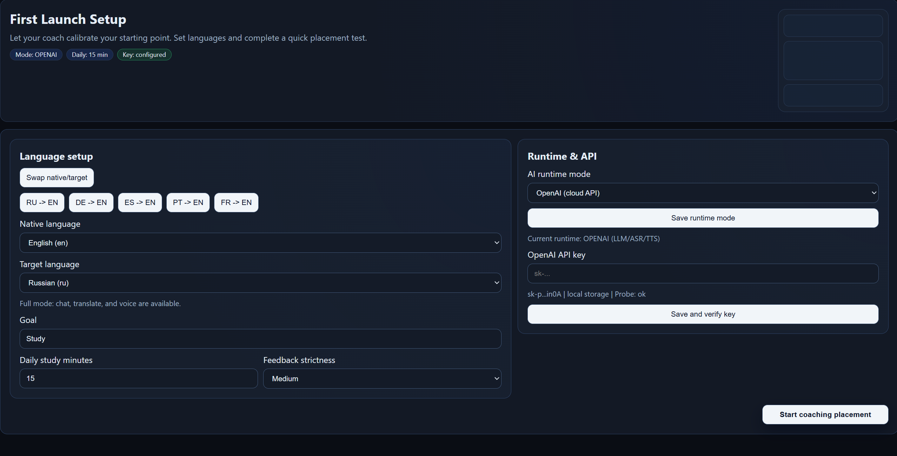

### 13.2 Profile
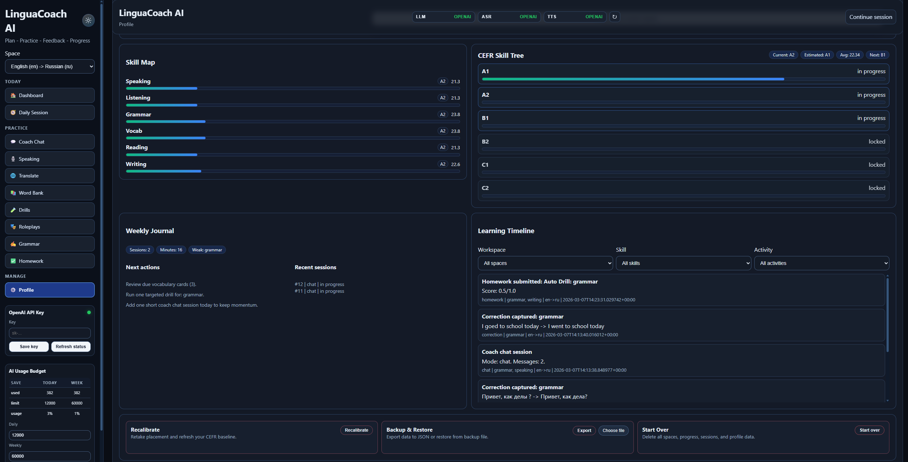

### 13.3 Dashboard
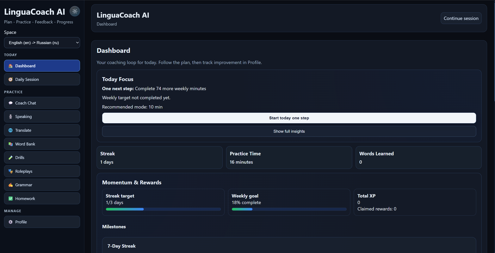

### 13.4 Daily Session
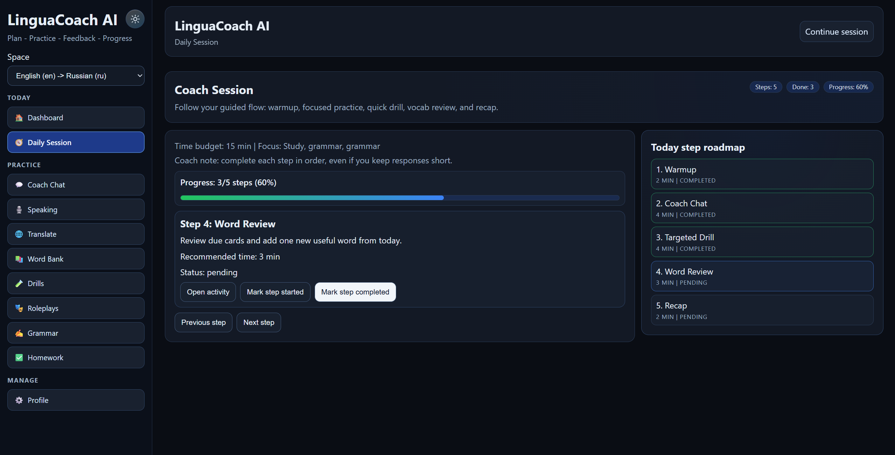

### 13.5 Coach Chat
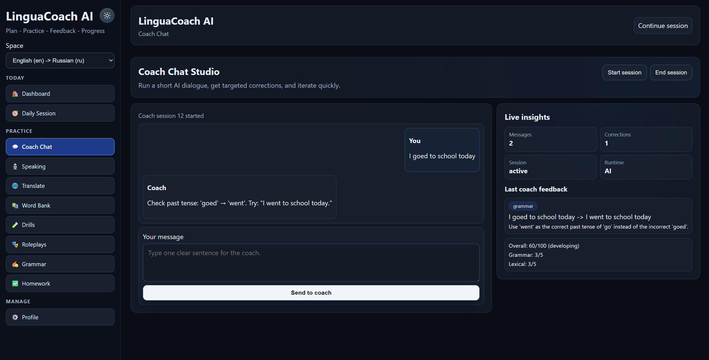

### 13.6 Voice Studio
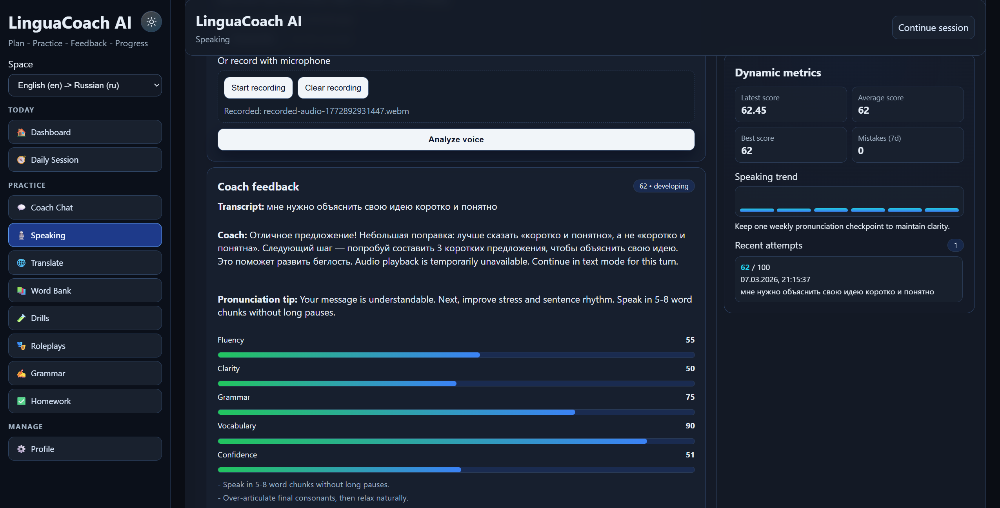

### 13.7 Drills
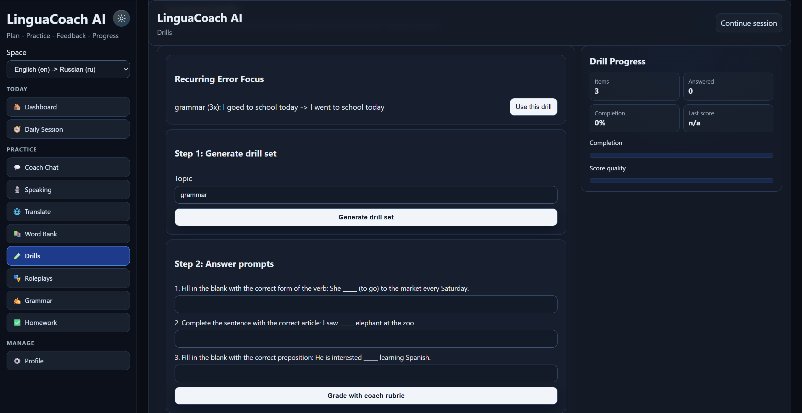

### 13.8 Roleplays
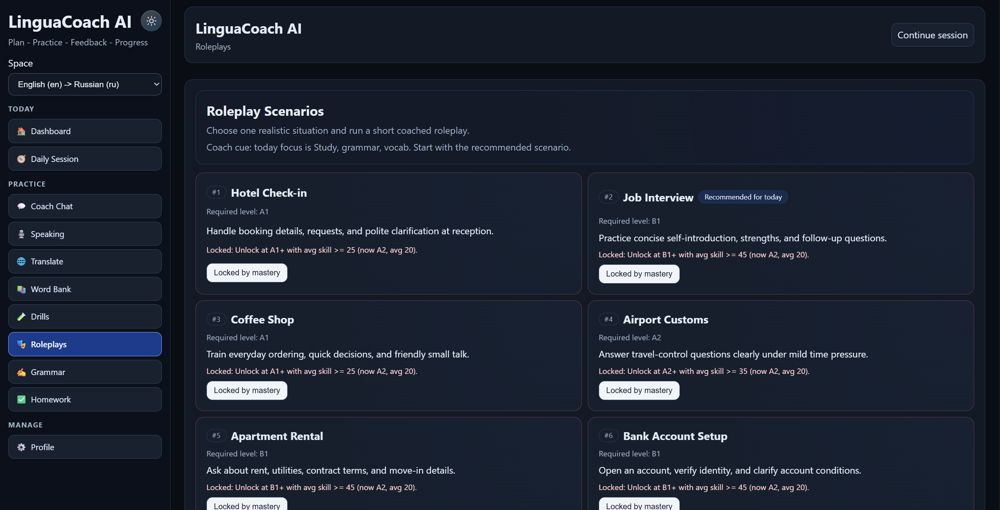

### 13.9 Grammar Analyzer
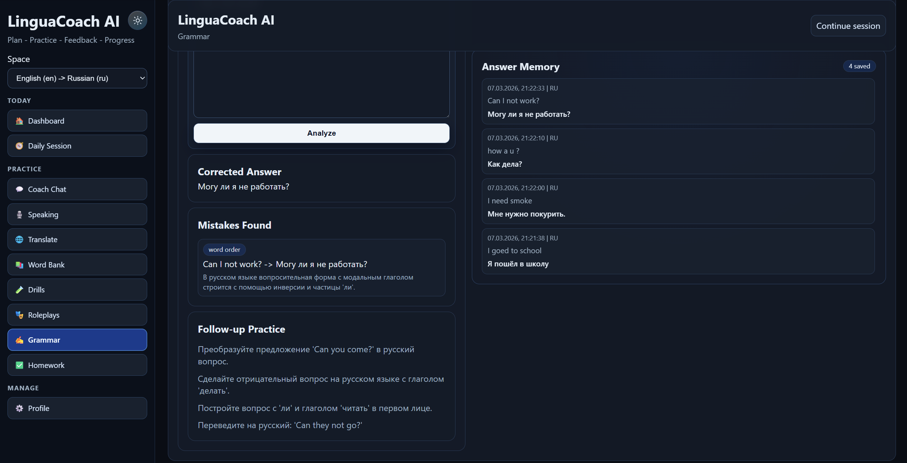

---

## 14. Test and CI Screenshots

### 14.1 Test Run
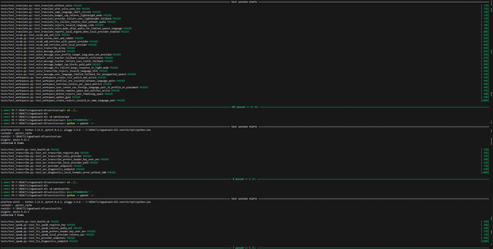

### 14.2 GitHub CI
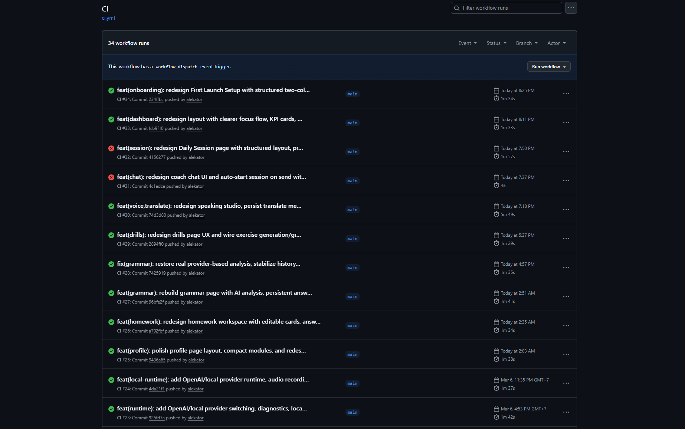

### 14.3 Workspace Flow
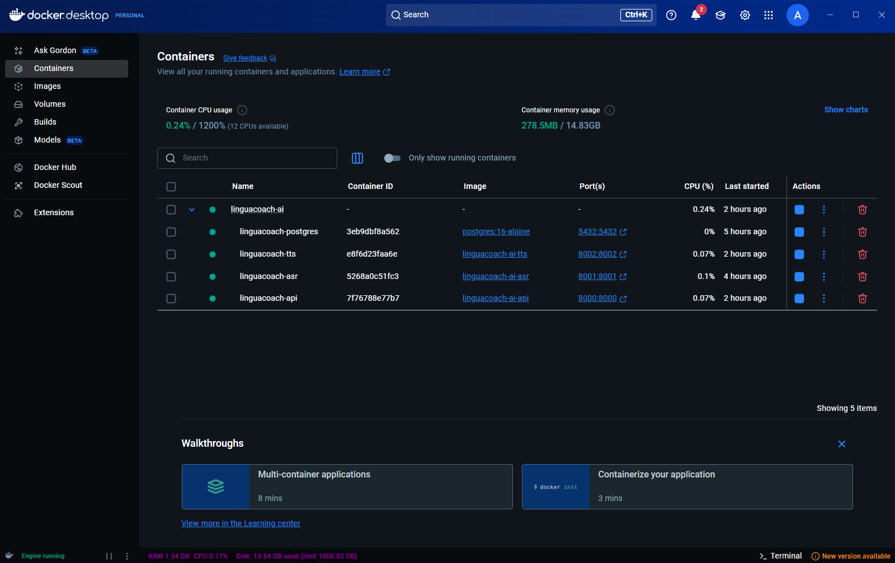

---

## 15. Troubleshooting

### `ModuleNotFoundError: fastapi` during pytest
- you are using system Python instead of project `.venv`
- activate `.venv` and verify with `where python`

### `No module named app`
- missing `PYTHONPATH` for service-level test run
- set `$env:PYTHONPATH="."` before running service tests

### `Failed to load AI runtime status`

```powershell
docker compose -f docker-compose.yml -f docker-compose.local-models.yml up -d --build api asr tts
```

### ASR/TTS local runtime failures

```powershell
docker compose -f docker-compose.yml -f docker-compose.local-models.yml logs asr --tail 200
docker compose -f docker-compose.yml -f docker-compose.local-models.yml logs tts --tail 200
```

### Desktop opens with blank UI
- ensure web dev server is running at `http://localhost:5173` before `npm run start:web`

---

## 16. Stop / Cleanup

```powershell
docker compose -f docker-compose.yml -f docker-compose.local-models.yml down
docker compose down
```

Stop local web/desktop processes with `Ctrl + C` in their terminals.

---

## 17. Contributor Notes

- never commit model files, `.env`, `node_modules`, or local caches
- update frontend API contracts when backend schema changes
- before push, run backend tests + web tests + web build
